## 基础

### 1

智能体定义：任何能够通过 **传感器Sensors** 感知其所处的环境，并 **自主** 地通过 **执行器Actutators** 采取 **行动Action** 以达成特定目标的实体

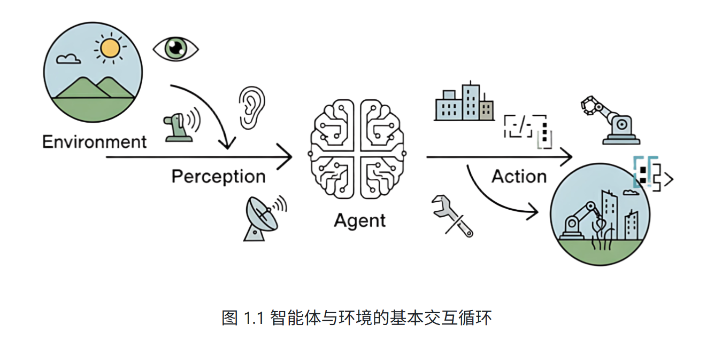

#### MAS: Multi-Agent System,多智能体系统

#### 第一性原理: 不依赖类比、惯例或别人怎么说，而是把问题拆解到最基本、可验证的事实，再从这些事实重新推导出结论或方案。

- 核心特点
  - 不受向来如此束缚：避免因为一直这样做所以这样做
  - 回到本质：什么是确定真的（物理规律、定义、
    数据、约束）
  - 从零推导：从底层事实推导出上层结论

- 类比思维的区别
  - 类比：A像B，所以A也这样办
  - 第一性原理：先问A的底层约束是什么，在设计解法

#### 智能体分类

- 基于内部决策架构：核心决策逻辑依赖于人类设计师的先验知识（预设），而非通过环境的互动自主学习（学习型智能体）。通常只有性能元件，无学习元件，学习元件可赋予下述智能体
  - 简单的**反应式**智能体：恒温器Simpe Reflex Agent
    - 决策基于瞬时感知
  - 基于模型的反射式智能体（**模型式**智能体）：隧道内行驶的汽车Model-Based Reflex Agent
    - 智能体拥有一个内部世界模型，汽车无法通过摄像头感知前方车辆，但内部模型会维持车辆速度、预估位置的判断
    - 决策基于：瞬时感知+更连贯、更完整的世界状态的理解
  - **基于目标**的智能体：GPS导航 Global-Based Agent
    - 通过算法规划处最优路径
    - 决策基于：对未来的考量和规划
  - **基于效用**的智能体：Utility-Based Agent
    - 时间最短、最省油、避开拥堵的路线
    - 决策基于：相互冲突的目标间权衡、使其决策更接近人类的理性选择

- 基于时间与反应性
  - 反应式智能体：及时反映.速度快、计算开销低
    - 简单反应式
    - 基于模型智能体
  - 规划式智能体：与反应式智能体相对,行动前会进行复杂的思考和规划.Deliberative（审慎，慎重考虑）
    - 基于目标的智能体
    - 基于效用智能体
  - 混合式Hybrid智能体：反应式+规划式智能体
    - 底层：快速反应模块
    - 高层：审慎规划模块
    - 分为:
      - 规划Reasoning(推理,论证)
      - 反应Acting & Observing

    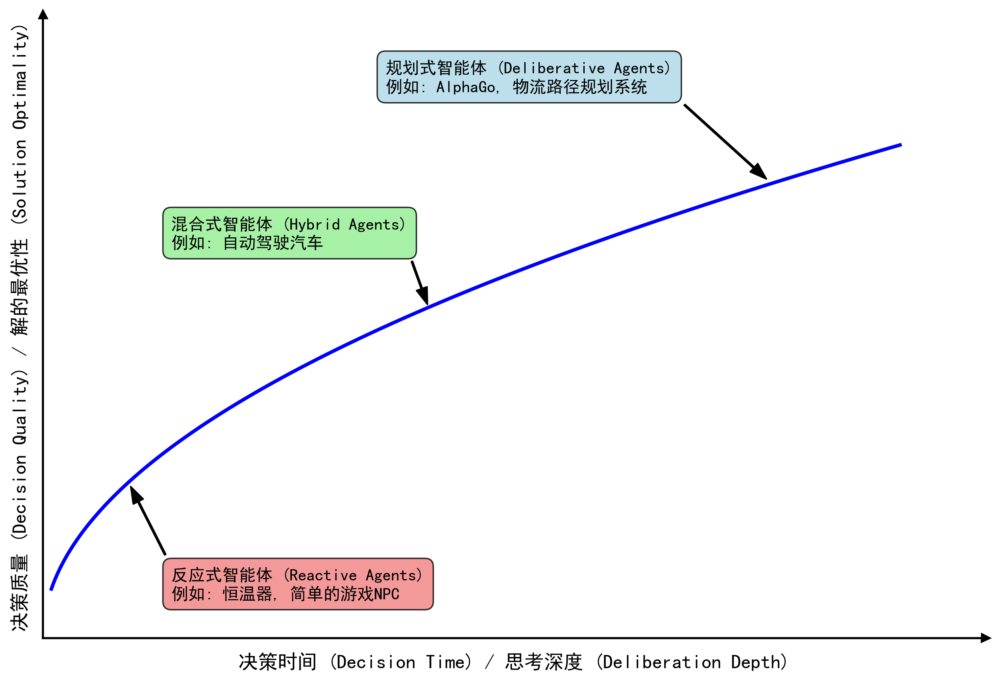

- 基于知识表
  - 符号主义Symbolic：智能源于对符号的逻辑操作
    - 符号： 人类可读实体（词语、概念）
    - 操作：遵循严格的逻辑规则
    - 知识获取瓶颈:符号注意依赖完备的规则体系,未被覆盖的新情况导致系统失灵
  - 亚符号主义
    - 知识并非显示规则，内隐地分布在有大量神经元组成的复杂网络中。具有前强大的模式识别能力（识别出猫，不知道为什么->不透明性）
    - 代表： 神经网络、深度学习
    - 不透明性、纯逻辑推理表现不佳，产生看似合理却事实错误的幻觉
  - 符号神经主义Neuro-Symbolic AI
    - 系统1：快速、凭直觉、并行思维模式，类似亚符号主义AI强大的模式识别能力
    - 系统2：缓慢、有条理、基于逻辑的审慎思维，类似符号主义AI的推理过程

    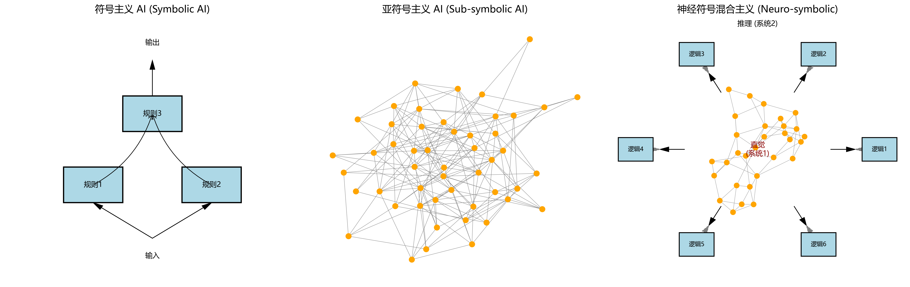

### 智能体构成与运行原理

#### 任务环境

常用PEAS模型描述任务环境

- 性能度量Performance：
- 环境Environment
- 执行器Actutators
- 传感器Sensors

  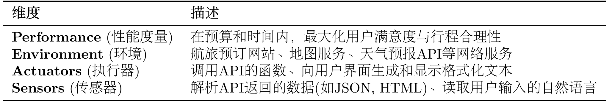

#### 运行机制

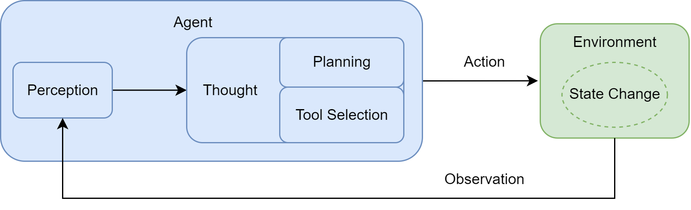

1. 感知Perception

   智能体通过传感器(Sensors:API监听端口、用户输入接口)接收来自环境的输入信息，即观察Obervation。观察：用户初始指令、上一步行动所导致环境状态变化的反馈

2. 思考Thought

   智能体进入核心决策阶段，通常由LLM驱动的内部推理过程
   1. 规划Planning：基于当前观察和内部记忆，更新对于任务和环境的理解，并制定或调整一个行动计划
   2. 工具选择Tool Selecting：根据当前计划，从可用工具库中选择最适合执行下一步骤的工具，确定调用该工具的具体参数

3. 行动Action

   决策完成后，智能体通过执行器Actuators执行具体行动。表现为调用一个选定的工具（如代码解释器、搜索引擎API），对环境施加影响，意图改变环境状态

**（感知Perception -> 思考Thought -> 行动Actiong -> 环境(状态变化Environment) -> 感知）** 往复循环

任务分解->工具调用->上下文理解->结果合成

交互范式：规范LLM和环境之间的信息交换。通常包含:Thought+Action+Obervation

- 思考Thought：智能体内部决策的快照。
  - Thought: 用户想知道北京的天气。我需要调用天气查询工具。
- 行动Action：智能体基于思考后，决定对环境施加的具体操作，通常以函数调用的形式表示
  - Action: get_weather("北京")
- 感知系统：此时可扮演传感器角色，将原始输出(通常为JSON对象)处理并封装成简洁、清晰的自然语言文本，即观Obersvation。该文本会作为下一轮输入反馈给智能体，促其进行下一轮Thought和Action
  - Observation: 北京当前天气为晴，气温25摄氏度，微风。

#### 智能旅行助手样例

- 指令模板
  - 设计一个指令模板，告诉LLM它应该扮演什么角色、拥有哪些工具、以及如何格式化它的思考和行动

#### 智能体角色/应用范式

1. 作为高效工具，深入融入工作流，如AI编程辅助工具
   1. GitHubCopilot：Copilot和OpenAi联合开发，代码补全闻名
   2. Claude Code：Ahthropic，自然语言指令帮助开发者在终端中完成编码任务。能完整理解代码库结构、执行代码编辑、测试、调试，支持从描述功能到代码实现的全流程开发
   3. Trace：专注于为开发者提供智能化的代码生成和优化服务
      - 特点：轻量级设计，快速响应能力
      - 适合需要频繁迭代和快速原型开发的场景
   4. Cursor：AI原生的代码编辑器

2. 作为自主协作者，与其他智能体协作完成复杂目标：命令-执行 演化为 目标-委托
   1. 单智能体自主循环：AgentGPT，核心是一个通用智能体通过"思考-规划-执行-反思"的闭环，不断进行自我提示和迭代以完成开放式的高层目标

   2. 多智能体协作：当前主流，通过模拟人类团队的协作模式来解决复杂问题
      - 角色扮演式对话：CAMEL，如2个智能体设置明确角色和沟通协议，让其在一个结构化对话中协同完成任务

      - 组织化工作流： MetaGPT，CrewAI。模拟一个分工明确的虚拟团队(如软件公司和咨询小组)，每个智能体都有预设的职责和工作流(SOP)，通过层级化或顺序化方式协作

      - AutoGen/AgentScope：更灵活的对话模式，允许开发者定义智能体间的复杂交互网络

   3. 高级控制流架构：LangGraph，侧重于为智能体提供强大的底层工程基础。将智能体的执行过程建模为状态图State Graph，能更灵活、更可靠地实现循环、分支、回溯以及人工介入等复杂流程

#### 工作流和智能体

1. 工作流Workflow：让AI按部就班地执行指令

- 核心：传统的自动化范式，对一系列任务或步骤进行预先定义的、结构化的编排
- 本质：精确的、静态的流程图，规定了在何种条件下、以何种顺序执行哪些操作

2. Agent：赋予AI自由度去自主达成目标

- 是一种具备自主性、以目标为导向的系统

- 不仅仅是执行预设指令，还能够在一定程度上理解环境、进行推理、制定计划，并动态采取行动以达成最终目标

####

- 心智社会特点：
  - 去中心化控制Decentralized Control：不存在中央控制器，即没有中心节点的协调机制和任务分配策略

  - 涌现式计算Emergent Computation：复杂问题的解决方案可以从简单的局部交互规则中自发产生

  - 智能体的社会性Agent Sociality：强调智能体之间的交互（激活、抑制）

- 涌现Emergence：复杂的、有目的性的智能行为，并非由某个高级智能体预先规划，而是从大量简单的底层智能体之间的局部交互中自发产生的。

- 分布式人工智能DAI：Distributed Artificial Intelligence

- 多智能体系统MAS：Multi-Agent System

#### 连结主义Connectionism

灵感来源：对生物大脑神经网络结构的模仿。解决了 **感知** 问题，例如这张图片里有什么

- 核心思想
  - 知识的分布式表示：知识以连接权重形式，分布式地存储在大量简单的处理单元(人工神经元)的连接之间

  - 简单的处理单元：每个神经元只执行非常简单的计算

  - 通过学习调整权重：系统通过接触大量样本，根据某种学习算法自动、迭代地调整神经元之间的连接权重，使整个网络的输出逐渐接近期望的目标

  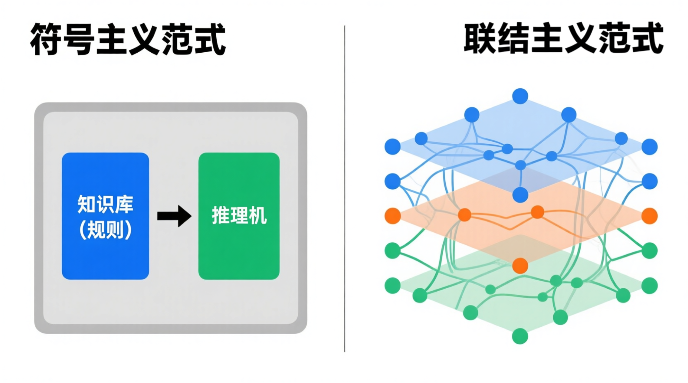

#### 基于强化学习的智能体

强化学习Reinforcement Learning,RL:专注于解决序贯 **决策** 问题的学习范式。例如在这种情况下，应该做什么

- 强化学习的框架的核心要素
  - 智能体(Agent)：学习者和决策者。如AlphaGo中，决策程序

  - 环境(Environment)：智能体与之交互的对象。如AlphaGo中，围棋规则和对手

  - 状态(State):对环境在某一时刻的特定描述，智能体做出决策的依据。如棋盘上所有棋子当前位置

  - 行动(Action):智能体根据当前状态所能采取的操作。如在棋盘某个合法位置上落下一子

  - 奖励(Reward)

  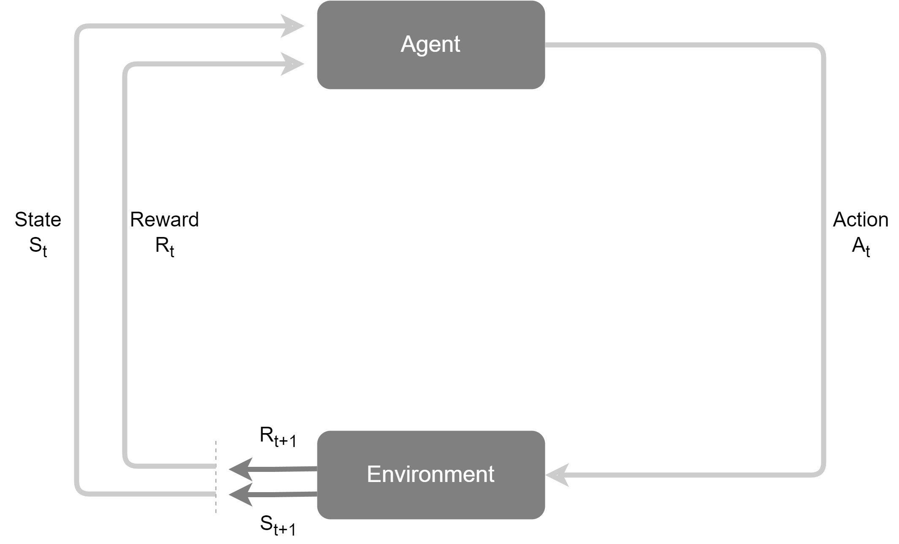

#### 基于大规模数据的预训练

自然语言处理Natural Language Processing,NLP

- 从特定任务到通用模型
  - 传统自然语言处理模型
    - 单一特定任务
    - 知识面狭窄，一个任务中学到的知识难以泛化到另一个任务
    - 新任务需耗费大量人力标注数据

  - 通用模型：预训练与微调范式
    - 预训练Pre-traning
      1. 在一个包含互联网级别海量文本数据的通用语料库上，通过自监督学习(self-supervised learning)的方式训练一个超大规模的神经网络模型
      2. 目标：并不完成特定任务，而是学习语言本身内在规律、语法结构、事实知识以及上下文逻辑。如 预测 下一个词

    - 微调Fine-tuning
      1. 针对特定的下游任务，使用少量该任务的标注数据对模型进行微调，让模型适应对应任务

    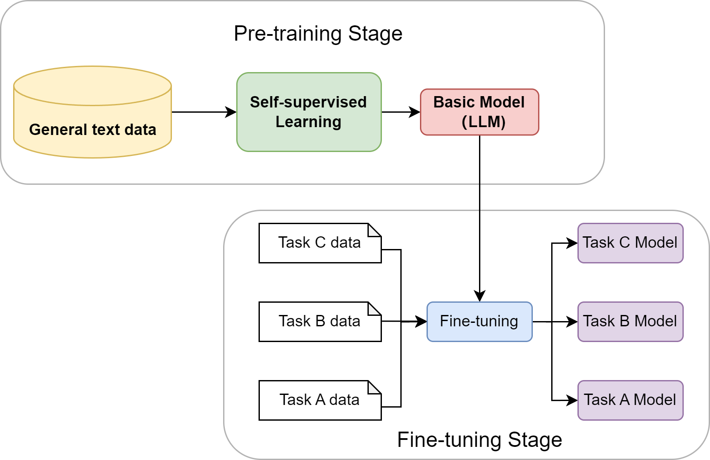

  - 大语言模型的诞生与涌现能力Emerge Abilites

    a. 上下文学习In-context learning：无需调整模型权重，仅在输入中提供几个示例Few-shot甚至零示例Zero-shot，模型就能理解并完成新任务
    b.思维链Chain-of Thought推理：通过引导模型在回答复杂问题前，先输出一步步的推理过程，可以显著提升其在逻辑、算术和尝试推理任务上的准确性

  - 智能体发展

    a. 符号主义：提供逻辑推理的框架
    a. 联结主义和强化学习：提供学习和决策的能力
    a. 大语言模型：提供前所未有的、通过预训练获得世界知识和通用推理能力

#### 基于大语言模型的智能体

**LLM驱动的智能体核心组件架构**

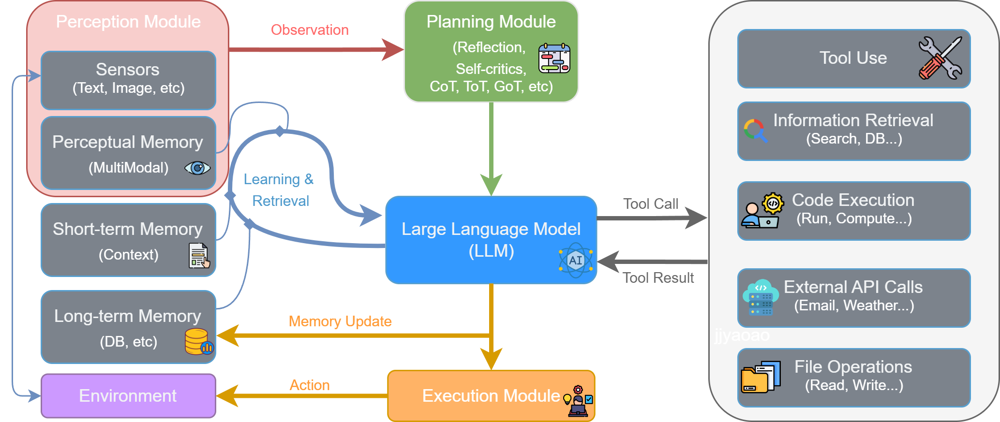

1. 感知Perception
   - 流程始于感知模块
   - 通过传感器从外部环境接收原始输入，形成观察
   - 这些观察信息（如用户指令、API返回的数据或环境状态的变化）是智能体决策的起点，处理后将被传递给思考阶段

2. 思考Thought
   - 智能体的认知核心，对应结构中的规划模块和大型语言模型的协同工作
   - 规划与分解
     - 规划模块接受观察信息，进行高级策略定制
     - 方式：通过反思和自我批判等机制，将宏观目标分级为更具体、可执行的步骤
   - 推理与决策
     - LLM接受规划模块的指令，并与记忆模块交互以整合历史信息
     - LLM进行深度推理，最终决策出下一步要执行的具体操作，通常表现为一个工具调用Tool call

3. 行动
   - LLM生成的工具调用指令被发送到执行模块
   - 执行模块解析指令，从工具箱Tool use中选择并调用合适的工具（如代码执行器、搜索引擎、API等）来与环境交互或执行任务。这个与环境的实际交互就是智能体的行动Action

4. 观察与循环：行动会改变环境状态，并产生结果
   - 工具执行后返回工具结果Tool Result给LLM，产生一个全新的环境状态
   - 工具结果和新的环境状态共同构成了一轮全新的观察，被感知模块再次捕获
   - LLM根据行动结果更新记忆，从而启动下一轮 **感知-思考-行动** 的循环

#### 语言模型与Transformer架构

# 统计语言模型

- 句子出现概率：等于该句子中每个词出现的条件概率连乘。
  - 链式法则：P(S)=P(w1 ,w2 ,…,wm )=P(w1 )⋅P(w2 ∣w1 )⋅P(w3 ∣w1 ,w2 )⋯P(wm ∣w1 ,…,wm−1 )

        + P(w2 ∣w1 ): 第一个词是w1的前提下，第二个词是w2的可能性。如P(w1)=0.2, P(w2 ∣w1 )=0.4则P(S)=0.2*0.4

            P(爱∣我)≈「我爱」这种接续出现的次数/「我▁」作为前缀出现的次数 =40/100=0.4

    ​

- N-gram模型：一个词的出现概率只与它前面有限的n-1个词有关。N表示上下文窗口大小

- 最大似然估计：最可能出现的，就是我们在数据库中看到次数最多的
  - P(wi∣wi−1)=Count(wi−1,wi)/Count(wi−1)
  - Count(wi−1,wi):表示 **词对 (wi−1,wi)** 在语料库中连续出现的总次数。
  - Count(wi−1):表示 **单个词wi−1** 在语料库中出现的总次数。

- N-gram缺陷：根本缺陷为将词视为孤立、离散的符号
  1. 数据稀疏性：如果一次词语序列从未在语料库中出现，其概率估计就为0

  2. 泛化能力差：模型无法理解词与词之间的语义相似性。如agent learns出现多次，但robot learns从未出现过，计算出的概率为0

#### 神经网络语言模型与词嵌入

核心思想：用连续的向量来表示词

- 构建一个语义空间
  - 创建一个高维的连续向量空间，将词汇表中的所有词都映射为该空间中的一个点(向量)。这个点称为词嵌入Word Embedding或词向量
  - 语义相近的词在空间中位置相近

- 学习从上下文到下一个词的映射
  - 利用神经网络强大拟合能力，学习一个函数。

  - 函数输入：前n-1个词的词向量

  - 函数输出：词汇表中每个词在当前上下文后出现的概率分布

  **神经网络语言模型架构示意图**
  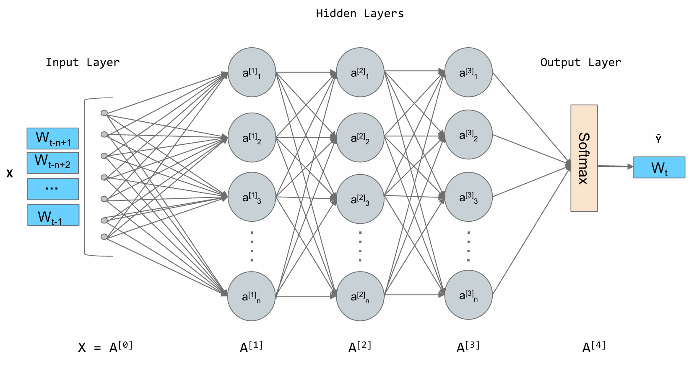
  - 余弦相似度：通过计算两个向量夹角的余弦值来衡量它们的相似性=点积 ÷ 两个向量范数乘积

  - 举个最简计算例子
    1. 设：a=(3,0), b=(3,4)

    2. 点积：a⋅b=3×3+0×4=9
    3. 范数：∣∣a∣∣=sqrt(3^2 +0^2) =3,∣∣b∣∣=(3^2+4^2) =5
    4. 相除：cosθ=9/(3×5) = 3/5 =0.6
    5. 0.6 就是两个向量的余弦相似度。

  - 余弦相似度结果范围：[−1, 1]
    1. 等于1：方向完全相同、正相关。夹角：0
    2. 等于0：互相垂直、无相关。夹角：90
    3. 等于−1：方向完全相反、负相关。夹角：180

  - 缺点： 上下文窗口固定大小，为预测下一个词，只能看到n-1个词，更早的历史信息被丢弃

#### 循环神经网络与长短时记忆网络

- RNN：Recurrent Neural Network：为网络增加记忆
  - 隐藏状态hidden state:网络短期记忆
    - 处理序列时：网络读取当前输入+上一刻记忆(上一时间步的隐藏状态) -> 生成新的记忆（当前时间步的隐藏状态） -> 传递给下一刻，往复循环

    **RNN结构示意图**
    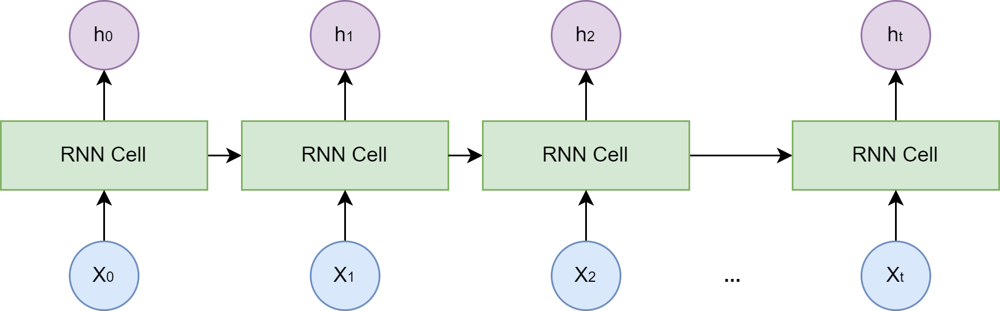

  - 缺陷
    - 长期依赖问题：训练过程中模型需要通过反向传播算法根据输出端的误差来调整网络深处的权重。RNN而言，序列长度=网络深度

    - 序列很长时，梯度在从后向前传播的过程中会经过多次连乘，导致梯度快速趋向于零（ **梯度消失** ） 或 变得极大（ **梯度爆炸** ）
      - 梯度消失：模型无法学习到序列早期信息对后期输出的影响，即难以捕捉长距离的依赖关系

      - 解决方案：长短时记忆网络LSTM：Long Short-term Memory，一种特殊的RNN
        1. 细胞状态Cell State:独立于隐藏状态的信息通路，允许信息在时间步之间更顺畅地传递
        2. 门控制机制：由几个小型神经网络构成
        - 遗忘门：决定从上一时刻的细胞状态中丢弃哪些信息
        - 输入门：决定将当前输入中的哪些新信息存入细胞状态
        - 输出门：决定根据当前的细胞状态，输出哪些信息到隐藏状态

    - 无法进行大规模并行计算：必须按顺序处理数据。第t个时间步的计算，必须等待t-1个时间步完成后才能开始

#### Transform架构

**Transform整体架构图**
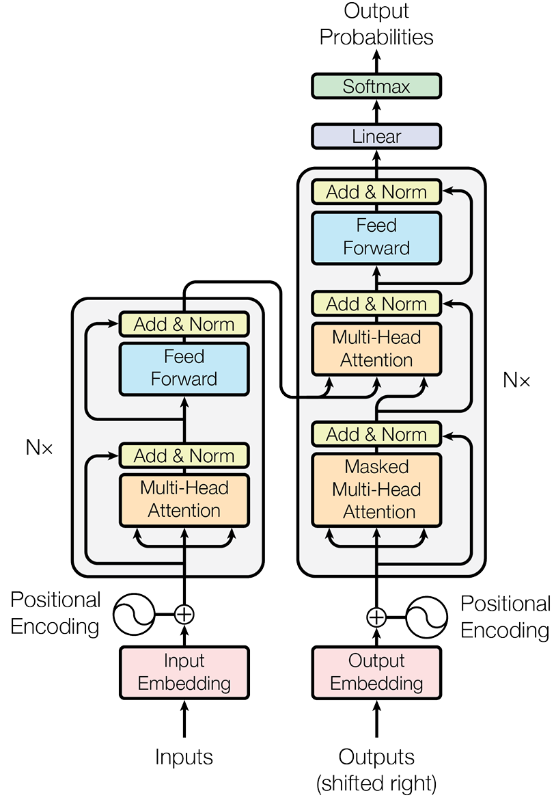

结构可理解为分工明确的团队：

- 编码器：理解输入的整个句子。读取所有的输入词元，最终为每个词元生成一个富含上下文信息的向量表示。

- 解码器：生成目标句子。参考已经生成的前文，咨询编码器的理解结果，生成下一个词。

- 自注意力机制Self-Attention:允许模型在处理序列中的每一个词时，都能兼顾句子中的所有其他词，并为这些词分布配不同的 **注意力权重** 。权重越高的词，代表其于当前词的关联性越强，其信息也应该在当前词的表示中占据更大的比重

- 注意力机制作用：从整个序列中动态地聚合相关信息
  1. 查询(Query,Q)：代表当前词元，它正在主动地查询其他词元以获取信息

  2. 键(Key,K)：代表句子中可被查询的词元"标签"或"索引"

  3. 值(Value,V)：代表词元本身所携带的"内容"或"信息"

  Q、K、V向量：由原始的词嵌入向量乘以三个不同的、可学习的权重矩阵(Wq,Wk,Wv)得到。单头注意力计算过程如下
  1. 准备考题和资料：对于句子中的每个词，通过权重矩阵生成其$Q，K，V$向量

  2. 计算相关性得分：

  3. 计算词$A$的新表示，进行点积运算

  4. 得分=词$A$.$Q$向量 \* $K$向量

  5. $K$：句子中所有词，包括词$A$的$K$向量。得分反应其他词对于理解词$A$的重要性

  6. 稳定化与归一化：计算权重

  7. 得分/缩放因子(sqrt{d*{k}})：d*{k}表示$K$向量的维度

  8. 归一化过程=Softmax(得分)：为防止梯度过小，函数将分数转换为总和为1的权重

  9. 加权求和：sum(权重\*每个词$V$向量)：词$A$融合了全局上下文信息后的新表示

  Attention(Q,K,V)=softmax((Q*K) / d\_{k}) * V

  单头注意力：模型可能只学会关注一种类型的关联。

  多头注意力计算：
  - 把一次做完分成几组，分开做再合并。
  - 将原始的Q,K,V向量从维度上切分成h份，每一份都进行一次单头注意力计算
  - 将多个输出向量(单头注意力计算结果)进行拼接，并通过线性变换进行整合。得到最终输出

  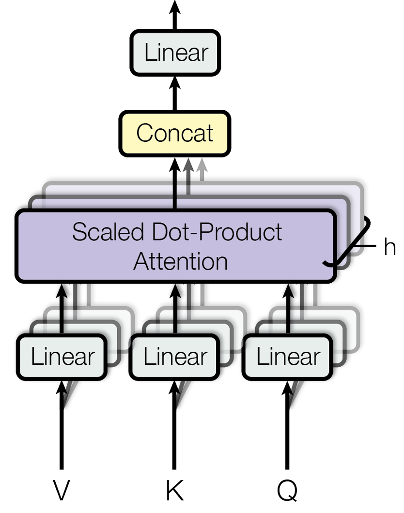
  - 逐位置前馈网络FFN：Position-wise Feed-Forward Network
    - FFN作用：从聚合后的信息中提取更高阶的特征

    - FFN会独立地作用于序列中的每个词元向量，即长度为seq_len的序列 FFN会被调用seq_len次。每次处理一个词元

    - FFN网络结构：两个线性变换+ReLU激活函数
      - FFN(x)=max(0,xW1+b1)W2+b2
      - $x$：注意力子层输出
      - W1,b1,W2,b2：可学习的参数

    - 特点：先扩大再缩小，有助于模型学习更丰富的特征表示
      - 第一个线性层的输出维度d_ff：远大于输入维度d_model，如d_ff=4\*d_model
      - 经过ReLU激活后：通过第二个线性层映射返回d_model维度

  - 残差连接与层归一化：每个编码器与解码器层中，所有子模块(如多头注意力与前馈网络)被一个Add & Norm包裹。为了保证Transform能够稳定训练
    - 残差连接Add
      - 将子模块的输入x 直接添加到子模块的输出Sublayer(x)上
      - 可解决深度网络中的梯度消失
      - 公式：$\text{Output} = x + \text{Sublayer}(x)$

    - 层归一化：对单个样本的所有特征进行归一化，使其均值为0，方差为1
      - 解决：模型训练过程中的 **内部协变量偏移**

  - 位置编码Position Encoding
    - 注意力机制只关心词元之间的关系，不关注顺序

    - 核心思想：为输入序列中的每一个词元嵌入向量，都为其添加一个能表示其 绝对位置 和 相对位置 的位置向量

    - 位置向量：通过固定的数学公式计算得出

#### Decoder-Only架构

抛弃编码器，只保留解码器部分。Decoder-Only架构的工作模式被称为自回归Autoregressive

过程：

1. 给模型一个起始文本
2. 模型预测出下一个最有可能的词
3. 模型将自己刚生成的词添加到输入文本末尾，形成新的输入
4. 模型基于这个新的输入，再次预测下一个词
5. 不断重复这个过程，直到生成完整的句子或达成停止条件

- 掩码自注意力Masked Self-Attention:可保证预测t个词时，不去偷看t+1个词
  - 计算相关性得分后(每个词对其他所有词的关注度得分),Softmax归一化前：模型应用一个掩码，该掩码会将所有位于当前位置之后(即目前尚未观测到)的词元对应的分数，替换为非常大负数。
  - Softmax(负数)-> 概率变为0

- Decoder-Only架构优势
  - 训练目标统一：唯一任务预测下一个词

  - 结构简单，易于扩展：GPT-4、Llama

  - 适合生成任务：对话、写作、代码生成等

#### 提示工程

提示工程就是 研究如何设计出精确的提示，从而引导模型产生我们期望输出的回复

1.  模型采样参数
    1. 传统概率分布：由Softmax公式计算得到，$p_i = \frac{e^{z_i}}{\sum_{j=1}^k e^{z_j}}$

    2. 温度采样：Temperature：温度是控制模型输出 “随机性” 与 “确定性” 的关键参数。

       a. 其原理是引入温度系数$T\gt0$,将 Softmax 改写为$p_i^{(T)} = \frac{e^{z_i / T}}{\sum_{j=1}^k e^{z_j / T}}$

       b. T值变化
       1. 变小：分布更加陡峭，放大高概率项权重，生成更 保守 且 高重复率文本
       2. 变大：分布更加平坦，提升低概率项权重，生成更 多样 但 可能出现不连贯的内容

       c. T值调优
       1. 低温度（0⩽ Temperature< 0.3）：输出更 精准、确定

          适用场景：
          1. 事实性任务：如问答、数据计算、代码生成；
          2. 严谨性场景：法律条文解读、技术文档撰写、学术概念解释等场景。

       2. 中温度（0.3 ⩽ Temperature< 0.7）：输出 平衡、自然

          适用场景：
          1. 日常对话：如客服交互、聊天机器人；
          2. 常规创作：如邮件撰写、产品文案、简单故事创作。

       3. 高温度（0.7 ⩽ Temperature< 2）：输出 创新、发散

          适用场景：
          1. 创意性任务：如诗歌创作、科幻故事构思、广告 slogan brainstorm、艺术灵感启发；
          2. 发散性思考。

    3. Top-k

       a. 原理：将所有token按概率从高到低排序，取排名前k个token组成候选集，对筛选出的k个token的概率进行归一化 $ \hat{p}i = \frac{p_i}{\sum{j \in \text{候选集}} p_j}$

       b. 温度采样区别
       1. 温度采样：通过温度T调整所有token的概率分布（平滑或陡峭），不改变候选token的数量

       2. Top-k： 通过k值限制候选token数量，再从其中采样。当k=1时，退化为 贪心采样

    4. Top-p

       a. 原理：将所有token按概率从高到低排序，从排序后第一个token开始，逐步累加概率，直到累积和首次达到或超过阈值p： ∑i∈S p(i)≥p。累加过程中包含的所有token组成 核集合， 对核集合进行归一化

       b. Top-k区别
       1. Top-p能动态适应不同分布的 长尾 特性，对概率分布不均的极端情况适应性更好

    5. 采样参数优先级

       a. 同时设置Top-p、Top-k、温度系数时，参数会按照分层过滤的方式协同工作

       b. 优先级： 温度调整 → Top-k → Top-p
       1. 温度调整整体分布的陡峭程度
       2. Top-k保留概率最高的k个候选
       3. Top-p从Top-k的结果中选取累积概率≥p的最小集合作为最终候选集

       c. 通常Top-k，Top-p二选一即可，同时设置，实际候选集为两者交集
       1. 温度=0时：Top-k，Top-p无关紧要，因为最有可能的token将称为下一个预测的token
       2. 设置Top-k=1时：温度和Top-p也无关紧要，因为只有一个token通过Top-k，且是下一个预测的token

2.  零样本、单样本与少样本提示

    a. 零样本提示Zero-shot Prompting：不给模型任何示例，直接让它根据指令完成任务
    1. 基础： 得益于模型在海量数据上预训练后获得的强大泛化能力。例如

        案例：直接向模型下达指令，要求它完成情感分类任务
        文本:Datawhale的AI Agent课程非常棒！
        情感:正面

    b. 单样本提示One-shot Prompting：给模型提供一个 完整 的示例，向它展示任务的格式和期望的输出风格

        案例：先给模型一个完整的“问题-答案”对作为示范，然后提出我们的新问题
        文本:这家餐厅的服务太慢了。
        情感:负面

        文本:Datawhale的AI Agent课程非常棒！
        情感:

        模型会模型给出的示例格式，为第二段文本补全"正面"

    c. 少样本提示Few-shot Prompting：提供多个示例，让模型更准确地理解任务的细节、边界和细微差别，从而获得更好的性能

        案例：提供涵盖不同情况的多个示例，让模型对任务由更全面的理解
        文本:这家餐厅的服务太慢了。
        情感:负面

        文本:这部电影的情节很平淡。
        情感:中性

        文本:Datawhale的AI Agent课程非常棒！
        情感:

        模型会综合所有示例，更准确地将最后一句的情感分类为"正面"

3.  指令调优Instruction Tuning

    早期的GPT模型（如GPT-3）主要是 文本补全 模型，擅长根据前面的文本续写，不一定能很好地理解并执行人类指令

    一种微调技术，大量使用"指令-回答"格式的数据对预训练模型进行进一步的训练。

    经过指令调优后，模型能更好地理解并遵循用户指令

    a. 对“文本补全”模型的提示(你需要用少样本提示“教会”模型做什么)：

        这是一段将英文翻译成中文的程序。
        英文:Hello
        中文:你好
        英文:How are you?
        中文:

    b. 对“指令调优”模型的提示(你可以直接下达指令)：

        请将下面的英文翻译成中文:
        How are you?

4.  基础提示技巧

    a. 角色扮演Role-playing：通过赋予模型一个特定的角色，引导它的回答风格、语气和知识范围，使其输出更符合特定场景的需求

        案例
        你现在是一位资深的Python编程专家。请解释一下Python中的GIL（全局解释器锁）是什么，要让一个初学者也能听懂。

    b. 上下文示例In-context Example：与少样本提示的思想一致。通过在提示中提供清晰的输入输出示例，来 教会 模型如何处理我们的请求，尤其是在处理复杂格式或特定风格的任务是非常有效

        案例
        我需要你从产品评论中提取产品名称和用户情感。请严格按照下面的JSON格式输出。

        评论:这款“星尘”笔记本电脑的屏幕显示效果惊人，但我不太喜欢它的键盘手感。
        输出:{"product_name": "星尘笔记本电脑", "sentiment": "混合"}

        评论:我刚买的“声动”耳机音质很棒，续航也超出了我的预期！
        输出:

5.  思维链Cot：Chain-of-Thought

    对于需要逻辑推理、计算或多步骤思考的复杂问题，直接让模型给出答案往往容易出错

    思维链 通过引导模型 一步一步地 思考，提升模型在复杂任务上的推理能力

    实现CoT关键：在提示中加入一句简单的引导语，如 "请逐步思考"

        思维链提示
        一个篮球队在一个赛季的80场比赛中赢了60%。在接下来的赛季中，他们打了15场比赛，赢了12场。两个赛季的总胜率是多少？
        请一步一步地思考并解答。

        >>>
        （模型可能会输出）
        好的，我们来一步步计算。
        第一步:计算第一个赛季赢得的比赛数。
        80场 * 60% = 48场。
        第二步:计算两个赛季的总比赛数和总胜利数。
        总比赛数 = 80 + 15 = 95场。
        总胜利数 = 48 + 12 = 60场。
        第三步:计算总胜率。
        总胜率 = (总胜利数 / 总比赛数) * 100% = (60 / 95) * 100% ≈ 63.16%。
        所以，两个赛季的总胜率约为63.16%。

#### 文本分词

分词Tokenization：将文本序列转换为数字序列的过程

分词器：定义一套规则，将原始文本切分成一个个最小的单元，称之为词元token

早期分词策略：

- 按词分词Workd-based：直接用空格或标点符号将句子切分成单词
  - 词表爆炸和未登录词

    未登录词OOV:Out-of-vocabulary:模型无法处理任何未在词表中出现过的词

  - 语义关联的缺失：模型难以捕捉词性相近的词之间的语义关系。如look、looks、looking被视为3个完全不同的词元

- 按字符分词Character-based：将文本切分成单个字符
  - 词表小，不存在OOV

  - 缺点：单个词大多不具备独立的语义，模型需花大量精力学习如何将字符组合成有意义的词，学习效率低下

现代分词策略：

- 子词分词Subword Tokenization算法：将常见词保留位完整词元，不常见词Tokenization拆分成多个有意义的子词片段如Token和ization

- 常见算法
  - 字节对编码：Byte-Pair Encoding，BPE。如GPT采用此算法

子词分词算法

1. 字节对编码BPE：核心思想可理解为一个 贪心 的合并过程

1. 初始化：将词表初始化为所有在 语料库 中出现过的基本字符
1. 迭代合并：语料库上，统计所有相邻词元对的出现频率，找到频率最高的一对，将他们合并成一个新词元，并加入词表
1. 重复：重复第二步，直到词表大小达到预设的阈值

1. WordPiece算法：与BPE相似，合并词元标准是 能最大化提升语料库的语言模型概率

- 也就是 优先合并能让整个语料库的 通顺度 提升最大的词元对

3. SentencePiece：Llama模型采用算法

- 特点：将空格视作普通字符，通常用下划线表示

分词器意义：

- 上下文窗口限制：不同语言或不同分词器，token数量可能相差巨大。

- API成本

- 模型表现的以长：如不同模型，2+2和 2 + 2，token大小写不同，变成不同token

#### 模型选择

- 性能与能力：不同模型擅长的任务不同，如
  - 擅长逻辑推理和代码生成

  - 创意写作或多语言翻译

- 成本
  - 闭源模型：API调用费用
  - 开源模型：本地部署所需硬件(GPU、内存)和运维

- 速度(延迟)：需实时交互的智能体(如客户、游戏NPC)，模型响应速度至关重要
  - 轻量级或经过优化的模型(GPT Turbo,Claude Sonnet)延迟表现更优

- 上下文窗口：模型能一次性处理的Token数量上限
  - 选择较大上下文窗口的模型：需理解长文档、分析代码库、维持长期对话记忆

- 部署方式
  - API：最简单，数据需要发送给第三方，受限于服务商的条款
  - 本地部署：能确保数据隐私和最高程度的自主可控。对技术和硬件要求高

- 生态与工具链：周边生态成熟度
  - 主流模型拥有更丰富的社区支持、教程、预训练模型、微调工具和兼容的开发框架

- 可微调性和定制化：需要处理特定领域数据或执行特定任务的智能体
  - 一些模型可提供便捷的微调接口和工具

- 安全性与伦理：需考虑偏见、读性、幻觉等表现

#### 模型种类

##### 1. 按开闭源分类

| 类型     | 国外                                                                      | 国内                                                                                                                                                         |
| -------- | ------------------------------------------------------------------------- | ------------------------------------------------------------------------------------------------------------------------------------------------------------ |
| **闭源** | OpenAI GPT (Codex内置) Google Gemini Anthropic Claude (Claude Code) | 百度文心一言 (ERNIE Bot) 腾讯混元 (Hunyuan) 华为盘古 (Pangu-α) 科大讯飞星火 (SparkDesk) 月之暗面 Kimi (Moonshot AI) 字节豆包 (Seed多模态家族) |
| **开源** | Meta Llama Mistral AI Google Gemma                                  | 阿里通义千问 (Qwen) 智谱AI (ChatGLM) DeepSeek 零一万物 (Yi)                                                                                         |

##### 2. 按垂直领域/特色分类

| 类别          | 代表模型                                                            | 特色说明                             |
| ------------- | ------------------------------------------------------------------- | ------------------------------------ |
| **代码生成**  | OpenAI Codex GitHub Copilot CodeGeeX                          | 专注代码理解与生成，支持多种编程语言 |
| **多模态**    | GPT-4V Gemini 字节Seed 阿里通义万相                        | 支持文本、图像、视频、音频跨模态理解 |
| **长文本**    | Kimi (200万字) Claude (100K tokens) GLM-4-Long                | 超长上下文窗口，适合文档分析         |
| **推理/数学** | o1/o3 (OpenAI) DeepSeek-R1 Kimi k1.5                          | 强化思维链，擅长复杂推理任务         |
| **行业专用**  | 华为盘古 (政务/气象) 百度文心 (搜索增强) 讯飞星火 (语音/教育) | 针对特定行业场景优化                 |

##### 3. 按本地部署 / 二次开发能力分类

| 能力层级                    | 含义                                                                | 代表模型 / 工具                                                                                            | 典型场景                           |
| --------------------------- | ------------------------------------------------------------------- | ---------------------------------------------------------------------------------------------------------- | ---------------------------------- |
| **仅 API 调用**             | 无权重、不可本地跑、不可改模型本体；只能通过官方 API / SDK 使用     | GPT-4o / o1 Gemini Claude 文心一言、混元、Kimi、豆包（商用 API）                                  | 快速接入、低运维；数据需走云端     |
| **API + 平台微调**          | 仍用云端模型，但可在厂商控制台做 SFT / RAG / Agent 编排；不拥有权重 | OpenAI Fine-tuning Azure OpenAI 通义千问百炼、文心千帆、智谱开放平台                                 | 领域问答、企业知识库，不改底层权重 |
| **可本地部署（推理）**      | 下载权重或 GGUF，在自有 GPU / CPU 上推理；数据不出内网              | Llama 3.x Qwen2.5 / Qwen3 DeepSeek-V3 / R1（蒸馏版更易部署） Gemma、Mistral、Yi、ChatGLM、MiniCPM | 私有化、离线、合规内网             |
| **可二次开发（训练/微调）** | 开放权重 + 许可允许微调；可 LoRA / 全参 / 继续预训练                | Llama、Qwen、DeepSeek、ChatGLM、Mistral、CodeGeeX                                                          | 垂直领域模型、私有化定制能力       |
| **端侧 / 轻量部署**         | 小参数量化后可在笔记本、手机、边缘设备运行                          | Qwen2.5-0.5B/1.5B Llama 3.2 1B/3B Phi-3/4-mini MiniCPM、Gemma 2B                                  | 低延迟、无 GPU、嵌入式 Agent       |

**本地部署常用工具栈**（与模型解耦，任选其一组合）：

- **推理框架**：Ollama、vLLM、TGI、llama.cpp、MLX（Apple 芯片）
- **量化格式**：GGUF、AWQ、GPTQ（降低显存与内存）
- **微调框架**：LLaMA-Factory、Axolotl、Unsloth、PEFT（LoRA）

**选型速记**：

| 需求                     | 优先选                                                 |
| ------------------------ | ------------------------------------------------------ |
| 要快、少运维             | 闭源 API 或国内大模型 API                              |
| 数据不能出网             | 开源权重 + Ollama / vLLM 本地推理                      |
| 要改模型行为（领域语料） | 开源 + LoRA 微调（Qwen / Llama / DeepSeek 生态最成熟） |
| 资源有限（无独显）       | 小模型 + 量化（1B～7B + GGUF）                         |

##### 4. 快速参考列表

**闭源模型**

- [OpenAI](https://openai.com) - GPT-4o, o1/o3, Codex
- [Google](https://ai.google.dev) - Gemini 1.5/2.0
- [Anthropic](https://anthropic.com) - Claude 3.x Sonnet/Opus
- [百度](https://yiyan.baidu.com) - 文心一言
- [阿里](https://tongyi.aliyun.com) - 通义千问 (API/网页版)
- [Kimi](https://kimi.moonshot.cn) - 月之暗面
- [字节](https://www.doubao.com) - 豆包

**开源模型**

- [Llama](https://llama.meta.com) - Meta 主导
- [Qwen](https://qwenlm.github.io) - 阿里开源
- [DeepSeek](https://deepseek.com) - 深度求索
- [ChatGLM](https://chatglm.cn) - 智谱AI
- [Mistral](https://mistral.ai) - 欧洲开源
- [Yi](https://www.lingyiwanwu.com) - 零一万物

### 大模型缩放法则与局限性

- 缩放法则Scaling Laws

  模型性能与模型参数、训练数据量、计算资源之间存在可预测的幂律关系

  模型参数量和训练数据量之间存在一个最优配比，并非越大越好

  产物：能力涌现，即当模型规模达到一定阈值后，突然展现出在小规模模型中完全不存在或表现不佳的全新能力
  - 链式思考Chain-of-Thought

  - 指令遵循Instruction Following

  - 多步推理

  - 代码生成等

- 模型幻觉Hallucination
  - 大语言模型生成的内容与客观事实、用户输入或上下文信息相矛盾，或者生成了不存在的事实、实体或事件

  - 幻觉本质：模型生成过程中，过度自信地 **编造** 了信息，而非准确地检索或推理

  - 分类
    - 事实性幻觉Factual Hallucination:模型生成与现实世界事实不符的信息。如不存在的文献、数据等，捏造信息

    - 内在幻觉Intrinsic Hallucination:模型生成的内容与输入信息直接矛盾。不是凭空编造不存在东西，而是把已知事实说错、搞混

    - 忠实性幻觉Faithfulness Hallucination:文本摘要、翻译等任务中，生成的内容未能忠实地反映原文本的含义

  - 产生原因
    - 训练数据中可能包含错误或矛盾的信息

    - 模型的自回归生成机制决定了它只是在预测下一个最可能出现的词元，而没有内置的事实审查模块

    - 需要复杂推理的任务，模型可能会在逻辑链条中出错，从而编造出错误的结论。如旅游规划Agent，生成不存在的航班号、景点

    - 训练数据的时效性不足

    - 训练数据中存在偏见

  - 缓和幻觉
    - 数据层面：通过高质量的数据清洗、引入事实性知识以及强化学习与人类反馈RLHF等

    - 模型层面：探索新模型架构，或让模型能够表达其对生成内容的不确定性

    - 推理与生成层面
      - 检索增强生成RAG：Retrieval-Augmented Generation

        RAG系统通过在生成之前从外部知识库（如文档数据库、网页）中检索相关信息，并将检索到的信息作为上下文，引导模型生成基于事实的回答

      - 多步推理与验证

        引导模型进行多步推理，并在每一步进行自我检查或外部验证

      - 引入外部工具

        允许模型调用外部工具（如搜索引擎、计算器、代码解释器）来获取事实信息或进行精确计算
