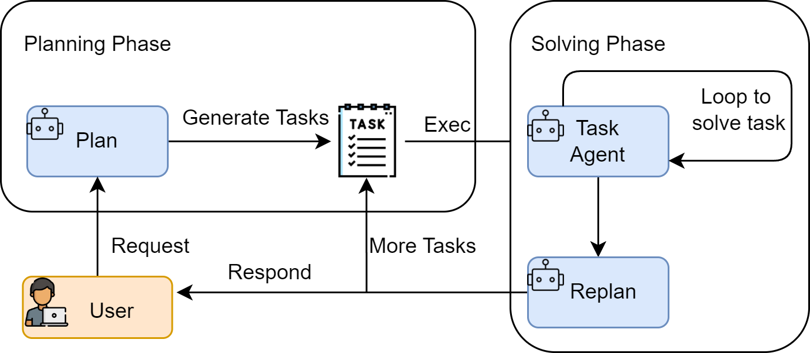

### Plan-and-Solve Agent

阶段：先规划Plan，后执行Solve

#### 工作原理

将整个流程解耦为Plan和Solve两个核心阶段

1. 规划阶段Planning Phase

    智能体接受用户的完整问题，并分解为多个子任务，并制定出一个清晰、分步骤的行动计划。行动计划本身就是一次大语言模型的调用产物。即：P = πplan(q)，其中q为用户的完整问题，P为行动计划

2. 执行阶段Solving Phase

    智能体根据规划阶段制定的行动计划，严格按照计划中的步骤逐步执行每个子任务。每一步执行都可能是一次独立的LLM调用，或是上一步结果的加工处理。直到计划中所有步骤完成得出答案。即：S = πsolve(q,P,(s1,s2,s3,...,sn))，其中q为用户的完整问题，P为行动计划，(s1,s2,s3,...,sn)为每一步执行的结果

#### 适用场景

适用于结构性强、可以被清晰分解的复杂任务

+ 多步数学应用题

    需要先列出计算步骤，再逐一求解

+ 需要整合多个信息源的报告撰写

    需要先规划好报告结构(引言、数据来源A、数据来源B、数据来源C、结论)，再逐一撰写每个部分

+ 代码生成任务

    需要先构思好函数、类和模块结构，再逐一实现
