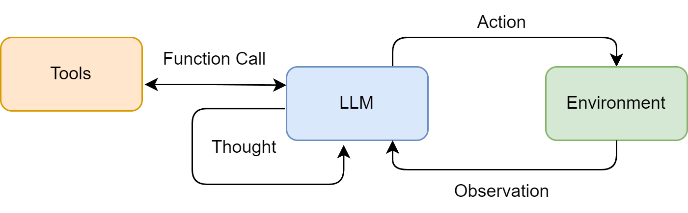

## 智能体经典范式构建

### 智能体面临的挑战

- 幻觉
- 复杂任务中可能陷入推理循环
- 对工具的错误使用

### 智能体经典范式

- ReAct范式：Reasoning and Acting，边想边做，动态调整

  ReAct Agent遵循"思考-行动-观察"的循环，通过多步推理和外部工具调用来解决复杂任务

- Plan-and-Solve：三思而后行

  Agent遵循"计划-执行-反思"的循环，通过先制定计划，再执行计划，最后反思结果来解决复杂任务

- Reflection：

  Agent通过反思来改进自己的决策和行为

### ReAct Agent

ReAct之前工作流

- 纯思考型：如思维链Chain-of-Thought

  能引导模型进行复杂的逻辑推理，无法与外部世界交互，容易产生 事实幻觉

- 纯行动型：模型直接输出要执行的动作，缺乏规划和纠错能力

ReAct范式

- Thought：思考，分析当前情况、分解任务、指定下一步计划或者反思上一步结果
- Action：行动，执行Action，如调用工具、执行命令
- Observation：观察，观察执行Action的结果

适用场景

- 需要外部知识的任务

  查询实时信息（如天气、新闻、股价）

  搜索专业领域的知识等，如法律、医学、金融等

- 需要精确计算的任务

  如复杂的数学计算、数据分析、科学研究等。避免LLM计算错误

- 需要与API交互的任务

  如调用API获取实时数据、执行系统命令、文件操作等

特点

- 高可解释性：透明

  ReAct Agent的决策过程是可解释的，可以清晰地看到Agent的思考过程和行动过程

- 动态规划和纠错能力

  ReAct Agent能够动态规划和纠错，能够根据执行结果调整下一步计划

- 工具协同能力

  ReAct Agent能够协同多个工具，共同完成复杂任务

  LLM负责规划和推理，工具负责解决具体问题，二者协同工作

局限性

- 对LLM自身能力的强依赖

      ReAct流程的成功与否，高度依赖于底层LLM的综合能力。
      如果LLM能力不足，ReAct流程可能无法正确执行，甚至陷入死循环。
      比如：LLM的逻辑推理能力、指令遵循能力或格式化输出能力不足，容易在Thought环节产生错误的规划，或在Action环节产生不符合格式的指令，导致整个流程中断

- 执行效率问题

      循序渐进的特性，完成一个任务需要多次调用LLM，每次调用伴随网络延迟和计算成本，导致执行效率低下

- 提示词的脆弱性

      ReAct流程对提示词非常敏感，提示词稍有变化，可能导致ReAct流程无法正确执行
      并非所有模板都能持续稳定地遵循预设格式(精心设计的提示词模板)，增加实际应用中的不确定性

- 可能陷入局部最优

      步进式决策意味着智能体缺乏全局的、长远的规划。在多步骤推理任务中，ReAct流程可能陷入局部最优解，无法找到全局最优解

调试

+ 检查完整提示词

      每次调用LLM之前，将最终格式化好的、包含所有历史记录的完整提示词打印出来。追溯LLM决策源头最直接的方式

+ 分析原始输出

      当输出解析失败时(如正则表达式没有匹配到Action)，将LLM返回的原始输出、未经处理的文本打印出来
      可帮助判断LLM是否按照预期格式生成了Action，还是解析逻辑有误

+ 验证工具的输入与输出

      调用工具前，打印工具的输入参数；调用后，打印工具的返回结果
      可帮助判断工具是否按照预期输入和输出，还是存在参数错误或返回结果不符合预期

+ 调整提示词中的实例(Few-Shot Prompting)

      增加完整的"Thought-Action-Observation"成功案例。引导模型更好地遵循指令

+ 尝试不同的模型或参数

      不同的模型或参数可能对ReAct流程有不同的效果，尝试不同的模型或参数，找到最适合的模型或参数
