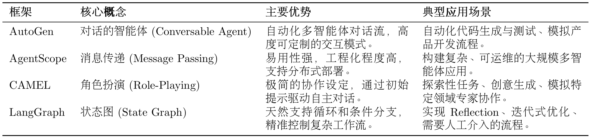
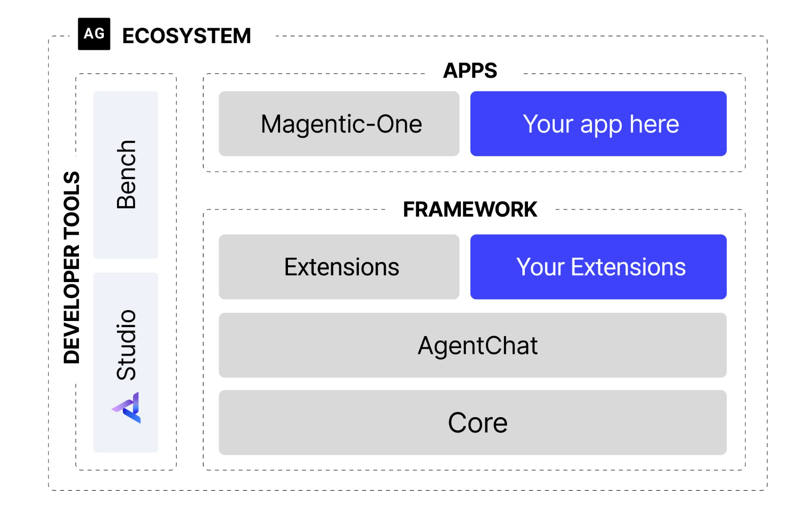

## 智能体框架

### 智能体系统的解耦和可扩展性

- 模型层Model Layer

  负责与LLM交流，可轻松替换不同的模型，如DeepSeek、Gemini、Claude等。

- 工具层Tool Layer

  提供标准化的工具定义、注册和执行接口，添加新工具不影响其他代码

- 记忆层Memory Layer

  处理短期记忆和长期记忆，可根据需求切换不同的记忆策略(如滑动窗口、摘要记忆)

这种模块化的设计使得整个系统极具扩展性，更换或升级任何一个组件都变得简单

### 主流框架

- 第一代通用LLM应用框架
  - LangChain
  - LlamaIndex

- 新一代框架

      + 多智能体协作Multi-Agent Collaboration
      + 复杂工作流控制Complex Workflow Control

  

1. AutoGen：对话的智能体Conversable Agent

    核心思想：通过对话实现协作

    将多智能体系统抽象为一个由多个"可对话"智能体组成的群聊

    开发者可以定义不同角色(如Code、ProductManager、Tester)，设定他们之间的交互规则(如Coder写完代码后由Tester自动接管)

2. Agent Scope：消息传递Message Passing

    核心特点：易用性和工程化

    消息传递机制、支持分布式部署

3. CAMEL：角色扮演Role-Playing

    核心思想：为两个智能体（如AI研究员和Python程序员）设定好各自的角色和共同的任务目标，它们就能在初始提示(Inception Prompting)的引导下，自主进行多轮对话、相互启发、配合，共同完成任务

4. LangGraph：状态图State Graph

    将智能体的执行流程构建为图


### AutoGen架构：任务分解为多个领域"专家"处理的子任务



#### 核心智能体组件

1. 助理智能体AssistantAgent -> 思考

    主要任务的解决者，核心封装LLM。

    职责：根据对话历史生成富有逻辑和知识的回复，如提出计划、撰写文章、编写代码

    通过不同的系统消息（System Message），可为其赋予不同的“专家”角色

2. 用户代理智能体UserProxyAgent -> 行动

    双重角色：

      1. 人类用户的"代言人"，负责发起任务和传达意图
      2. "执行器"：可配置为执行代码或调用工具，并将结果反馈给其他智能体

#### Team、群聊

多智能体协作时的协调对话流程的机制

早期：GroupChatManager

新架构：Team/群聊，如RoundRobinGroupChat

+ 轮询群聊RoundRobinGroupChat

  明确的、顺序化的对话协调机制：让参与的智能体按照预先定义的顺序依次发言

  适用场景：流程固定的任务，如软件开发流程：PM提出需求、PG编写代码、代码审核员检查

+ 工作流

  1. 创建RoundRobinGroupChat实例，将所有参与协作的智能体（如PM、工程师等）加入其中
  2. 当任务开始时，群聊按照预设的顺序依次激活相应智能体
  3. 被选中的智能体根据当前的对话上下文进行响应
  4. 群聊将新的回复加入对话历史，激活下一个智能体
  5. 过程持续，直到达到最大对话轮次或满足预设的中止条件

#### 软件开发团队

1. 业务目标

    开发功能明确的Web应用：实时显示比特币当前价格，完整覆盖软件开发的环节：需求分析、技术选型、编码实现、代码审查、最终测试

2. 智能体团队角色

    + ProductManager(产品经理)：将用户模糊的需求转化为清晰、可执行的开发计划
    + Engineer(工程师)：依据开发计划，负责编写具体的应用程序代码
    + CodeReviewer(代码审核员)：审查工程师提交的代码，确保质量、可读性、健壮性
    + UserProxy(用户代理)：代表最终用户，发起初始任务、负责执行和验证最终交付的代码

3. 核心实现

    + 模型客户端

      基于LLM的智能体都需要一个模型客户端与LLM进行交互

    + 智能体角色定义

      系统消息：给智能体设定的"行为准则"和"专业知识库"

      精确规定智能体的 __角色、职责、工作流程、与其他智能体交互的方式__

#### AutoGen优势与局限性

1. 优势

    + 无需为智能体团队设计复杂的状态机或控制流逻辑，而是将一个完整的软件开发流程，自然地映射为产品经理、工程师和审查员之间的对话。开发者可将精力聚焦于定义"谁（角色）"以及"做什么（职责）"，而非"如何做（流程控制）"

    + 框架允许通过系统消息为每个智能体赋予高度专业化的角色

      + 如PM专注于需求，CodeReviewer专注于质量

      + 精心设计的智能体可在不同项目中被服用，易于维护和扩展

    + 对于流程化任务，轮询群聊机制提供了清晰、可预测的协作流程

      + 用户代理：可作为任务的发起者、流程的监督者和最终验收者。确保自动化系统始终处于人类监督之下

2. 局限性

    + 基于LLM对话本质上具有不确定性

      + 智能体可能产生偏离预期的回复，导致对话走向意外分支，甚至陷入循环

    + 当智能体团队工作结果未达预期时，调试过程棘手

      + 没有清晰的错误堆栈，而是一长串对话历史（"对话式调试"难题）

#### 模型配置

``` python
# OpenAI系列模型
from autogen_ext.models.openai import OpenAIChatCompletionClient

def create_openai_model_client():
    """创建并配置 OpenAI 模型客户端"""
    return OpenAIChatCompletionClient(
        model=os.getenv("LLM_MODEL_ID", "gpt-4o"),
        api_key=os.getenv("LLM_API_KEY"),
        base_url=os.getenv("LLM_BASE_URL", "https://api.openai.com/v1")
    )

# 非OpenAI系列模型
from autogen_ext.models.openai import OpenAIChatCompletionClient

model_client = OpenAIChatCompletionClient(
    model="deepseek-chat",
    api_key=os.getenv("DEEPSEEK_API_KEY"),
    base_url="https://api.deepseek.com/v1",
    model_info={
        "function_calling": True,
        "max_tokens": 4096,
        "context_length": 32768,
        "vision": False,
        "json_output": True,
        "family": "deepseek",
        "structured_output": True,
    }
)

```
