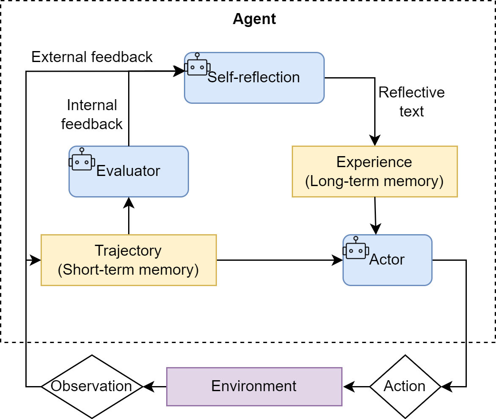

## Reflection Paradigm

机制核心：为智能体引入一种事后post-hoc的自我校正循环

### 工作流程

执行→反思→优化

1. 执行Execution

   智能体用ReAct或Plan-and-Solve尝试完成任务，生成一个初步的解决方案或行动轨迹。可看作初稿

2. 反思Reflection

   智能体调用一个独立的、或者带有特殊提示词的大语言模型实例，来扮演一个 **评审员** 的角色

   评审员会审视初稿并从多个维度进行评估
   - 事实性错误

     是否存在与常识或已知事实相悖的内容

   - 逻辑漏洞

     推理过程是否存在不连贯或矛盾的地方

   - 效率问题

     是否有更直接、更简洁的路径来完成任务

   - 遗漏信息

     是否忽略了问题的某些关键约束或限制

   评估会生成一段结构化的 **反馈**， 指出具体问题所在和改进建议

3. 优化Refinement

   智能体将初稿和反馈作为新的上下文，调用LLM要求它根据反馈内容对初稿进行修正和优化，生成一个改进后的版本。可看作修订稿

临界条件/循环终止条件

    1. 反思阶段不再发现新问题
    2. 达到预设的迭代次数

### 特点

1. 为智能体提供了内部纠错回路，使其不再完全依赖于外部工具的反馈（ReAct的Observation）

2. 将一次性任务的执行，转变为持续优化的过程，显著提升复杂任务的最终成功率和答案质量

3. 为智能体构建 短期记忆 和 长期记忆，使其能够从过去的经验中学习，并避免重复犯错

### Reflection机制的成本收益分析

1. 主要成本

    a. 模型调用开销增加

        每进行一轮迭代，至少需要额外调用两次LLM(一次反思，一次优化)
        如果迭代多轮，API调用成本和计算资源消耗将成倍增加
        并且需要额外的存储空间来存储反思和优化过程中的中间结果

    b. 任务延迟显著提高

        Reflection是串行过程，每一轮的优化都要等上一轮的反思完成

        任务总耗时显著延长，不适合对实时性要求高的场景

    c. 提示工程复杂度上升

        Reflection需要精心设计的提示词模板，才能让LLM正确执行反思和优化过程

        执行、反思、优化等不同阶段设计和调试有效的提示词，需投入更多开发精力

2. 核心收益

    a. 解决方案质量显著提升

        能将一个 合格 的初始方案，迭代优化成一个优秀的最终方案

        功能正确性 -> 性能高效性
        逻辑粗糙 -> 逻辑严谨

    b. 鲁棒性与可靠性

        通过内部自我纠错循环，智能体能发现并修复初始方案中可能存在的逻辑漏洞、
        事实性错误或边界情况处理不当等问题，提高最终结果的可靠性

### 适用场景

对最终结果的质量、准确性和可靠性有极高要求，并且对任务完成的实时性要求相对宽松的场景

+ 生成关键的业务代码或技术报告

+ 在科学研究中进行复杂的逻辑推演

+ 需要深度分析和规划的决策支持系统

