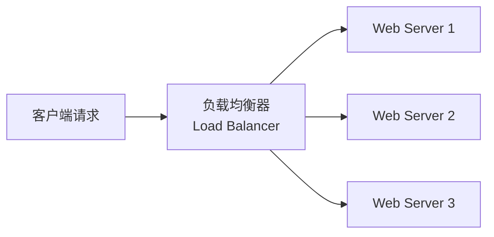
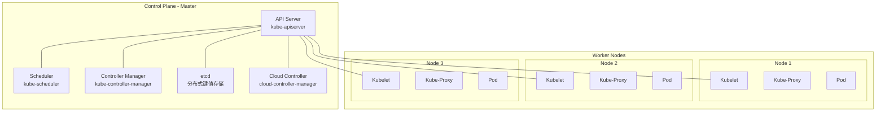

# 集群概念

## 什么是集群

**集群（Cluster）** 是指将多台计算机（节点）通过网络连接，协同工作对外提供服务的系统。对外表现为一个整体，内部通过分布式协作实现高可用、高并发、可扩展等目标。

## 常见集群类型

### 1. 负载均衡集群（Load Balancing Cluster）

**目的**：将请求分发到多个后端节点，提高并发处理能力。

- **LVS**（Linux Virtual Server）：Linux 内核级四层负载均衡
- **Nginx**：七层负载均衡（HTTP/HTTPS），也可做四层
- **HAProxy**：专业 TCP/HTTP 负载均衡器
- **云 LB**：AWS ELB/ALB、Azure Load Balancer、阿里云 SLB



### 2. 高可用集群（High Availability Cluster）

**目的**：避免单点故障（SPOF），保证服务持续可用。

- **Keepalived** + **VRRP**：主备模式，通过虚拟 IP（VIP）漂移实现故障转移
- **Pacemaker + Corosync**：Linux 上的 HA 集群管理
- **K8s 自愈**：Pod 故障自动重启、节点故障调度

| 模式                   | 说明                           | 示例             |
| ---------------------- | ------------------------------ | ---------------- |
| 主备（Active-Passive） | 一台工作，一台待命，故障时切换 | Keepalived + VIP |
| 双活（Active-Active）  | 多台同时工作，互相备份         | K8s 多 Master    |
| 多活（Multi-Active）   | 多节点同时处理请求             | 分布式数据库     |

### 3. 分布式存储集群

**目的**：多台机器共同存储数据，解决单机容量和可靠性限制。

- **Ceph**：统一的分布式存储（块/对象/文件）
- **GlusterFS**：分布式文件系统
- **MinIO**：S3 兼容的对象存储
- **HDFS**：Hadoop 分布式文件系统（大数据场景）
- **Redis Cluster**：内存缓存集群
- **Elasticsearch Cluster**：搜索引擎集群

### 4. 计算集群 / 分布式计算

**目的**：集中算力处理大规模计算任务。

- **Hadoop / Spark**：大数据批处理
- **Flink**：实时流计算
- **MPI 集群**：高性能科学计算

### 5. 数据库集群

**目的**：数据库读写分离、分片、高可用。

- **MySQL 主从 / Group Replication / InnoDB Cluster**
- **PostgreSQL 流复制 / Patroni**
- **MongoDB Replica Set / Sharded Cluster**
- **Cassandra / ScyllaDB**：去中心化分布式数据库

### 6. 容器编排集群 — Kubernetes

**目的**：自动部署、伸缩和管理容器化应用，本质上是**集群的管理平台**。

Kubernetes（K8s）本身不只是一个集群类型，而是**集负载均衡、高可用、存储编排、自动扩缩容于一体的综合性集群平台**。

#### 架构概览



#### 核心组件

| 组件                   | 角色       | 说明                                                 |
| ---------------------- | ---------- | ---------------------------------------------------- |
| **API Server**         | 控制面入口 | 所有操作都通过 API Server（RESTful），是集群的"前端" |
| **etcd**               | 集群数据库 | 分布式键值存储，保存所有集群状态（唯一有状态组件）   |
| **Scheduler**          | 调度器     | 决定 Pod 调度到哪个 Worker 节点                      |
| **Controller Manager** | 控制器     | 运行各种控制器（Deployment、Node、Namespace 等）     |
| **Kubelet**            | 节点代理   | 每个 Worker 节点上的 Agent，负责管理 Pod 生命周期    |
| **Kube-Proxy**         | 网络代理   | 维护节点上的网络规则，实现 Service 负载均衡          |
| **Container Runtime**  | 容器运行时 | Docker、containerd、CRI-O 等                         |

#### K8s 集群 vs 传统集群

| 维度         | 传统集群                      | Kubernetes 集群                           |
| ------------ | ----------------------------- | ----------------------------------------- |
| **部署方式** | 手动配置                      | 声明式（YAML/Helm）                       |
| **自愈能力** | 需外部工具（Keepalived）      | 内置（Pod 自动重启、节点自愈）            |
| **扩缩容**   | 手动 + 监控脚本               | 自动（HPA / VPA / Cluster Autoscaler）    |
| **滚动更新** | 手动操作                      | 内置（Rolling Update / 回滚）             |
| **服务发现** | 需单独搭建（Consul / ZK）     | 内置（Service + DNS）                     |
| **负载均衡** | 需单独配置（Nginx / HAProxy） | 内置（Service ClusterIP / NodePort / LB） |
| **存储编排** | 手动挂载                      | 内置（PV / PVC / StorageClass）           |
| **网络**     | 需手动管理                    | CNI 插件（Calico / Flannel / Cilium）     |

#### 常用 K8s 集群部署工具

| 工具                | 说明                    | 架构        | 启动速度       | 资源占用       | 生产可用 | 适合场景              |
| ------------------- | ----------------------- | ----------- | -------------- | -------------- | -------- | --------------------- |
| **kubeadm**         | K8s 官方工具            | 原生进程    | 🟡 中等        | 🟡 中等        | ✅ 是    | 生产环境自建集群      |
| **K3s**             | Rancher 轻量级（~60MB） | 原生进程    | 🟢 快          | 🟢 低 (~512MB) | ✅ 是    | 边缘计算、IoT、CI     |
| **MicroK8s**        | Canonical Snap 包       | Snap+原生   | 🟢 快          | 🟢 低          | ✅ 是    | 开发测试、Ubuntu 环境 |
| **minikube**        | 官方本地集群            | 虚拟机 (VM) | 🔴 慢          | 🔴 高          | ❌       | 本地学习、功能测试    |
| **kind**            | Docker 内运行 K8s       | Docker 容器 | 🟢 最快 (秒级) | 🟢 低          | ❌       | CI/CD、快速测试       |
| **kOps**            | AWS 集群管理            | 云基础设施  | 🟡 中等        | 🟡 按需        | ✅ 是    | AWS 生产环境          |
| **AKS / EKS / GKE** | 云厂商托管              | 云托管      | 🟢 快          | 🟢 按需        | ✅ 是    | 生产环境（免运维）    |

##### 本地开发集群详细对比

适合在个人电脑上安装的四种方案：

| 维度             | **minikube**                 | **kind**            | **K3s**           | **MicroK8s**       |
| ---------------- | ---------------------------- | ------------------- | ----------------- | ------------------ |
| **维护方**       | K8s 社区                     | K8s 社区 (SIG)      | Rancher (SUSE)    | Canonical (Ubuntu) |
| **实现原理**     | 虚拟机内跑 K8s               | Docker 容器内跑 K8s | 轻量级 K8s 发行版 | Snap 包 + 原生进程 |
| **启动速度**     | 🟡 中等（需启动 VM）         | 🟢 最快（秒级）     | 🟢 快             | 🟢 快              |
| **资源占用**     | 🔴 较高（VM 开销）           | 🟢 低               | 🟢 低             | 🟢 低              |
| **Windows 支持** | ✅ 好（HyperV/VirtualBox）   | ✅ 好（需 Docker）  | ⚠️ WSL2 推荐      | ⚠️ WSL2 推荐       |
| **多节点**       | ✅ 支持                      | ✅ 支持             | ✅ 支持           | ✅ 支持            |
| **插件/Addons**  | ✅ 丰富（Dashboard/Ingress） | ⚠️ 需手动配置       | ✅ 内置           | ✅ 内置            |
| **生产级功能**   | ❌ 仅开发测试                | ❌ 仅开发测试       | ✅ 可生产         | ✅ 可生产          |
| **最适场景**     | 需完整 K8s 功能的学习        | CI/CD、频繁重建     | 边缘计算/资源受限 | Ubuntu 开发者      |

> 💡 **推荐**：学习 Chaos Mesh 或临时测试用 **kind**（秒级启动用完即删）；日常学习用 **minikube** 或 **K3s**；生产环境用 **kubeadm** 或云托管集群。

#### 核心概念（K8s 资源对象）

```
Pod         ─ 最小调度单元（一组容器）
  ├── Service    ─ 稳定的网络入口（负载均衡）
  ├── Deployment ─ 声明式应用管理（副本数、更新策略）
  ├── ConfigMap / Secret ─ 配置管理
  ├── PV / PVC   ─ 持久化存储
  ├── Ingress    ─ HTTP/HTTPS 七层路由
  ├── Namespace  ─ 资源隔离
  └── HPA        ─ 自动扩缩容
```

## 集群关键概念

| 概念                    | 说明                                           |
| ----------------------- | ---------------------------------------------- |
| **节点（Node）**        | 集群中的单台机器                               |
| **Master / Worker**     | K8s 中的控制节点（Master）和工作节点（Worker） |
| **VIP（虚拟 IP）**      | 高可用集群中浮动的外部访问 IP                  |
| **心跳（Heartbeat）**   | 节点间定期发送的健康检查信号                   |
| **脑裂（Split-Brain）** | 网络分区导致多个节点同时认为自己是主节点       |
| **水平扩展**            | 增加节点数来提升性能                           |
| **垂直扩展**            | 升级单节点硬件来提升性能                       |

## 集群与分布式的区别

|      | 集群                         | 分布式                             |
| ---- | ---------------------------- | ---------------------------------- |
| 核心 | 多台机器做**相同的事**       | 多台机器做**不同的事**（分工协作） |
| 目标 | 高可用、高并发               | 解决单机无法处理的大规模问题       |
| 关系 | 分布式系统通常以集群形式运行 | 集群不一定是分布式系统             |

> 实践中两者常结合：一个分布式系统（如 Hadoop）的每个组件（HDFS、YARN）各自以集群方式运行。
