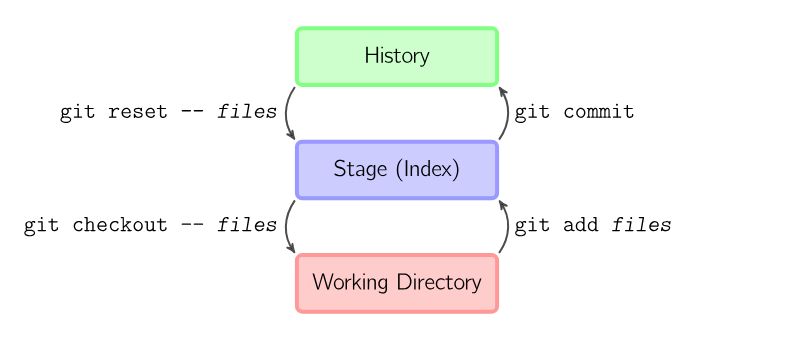
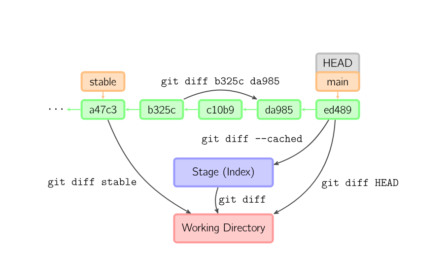
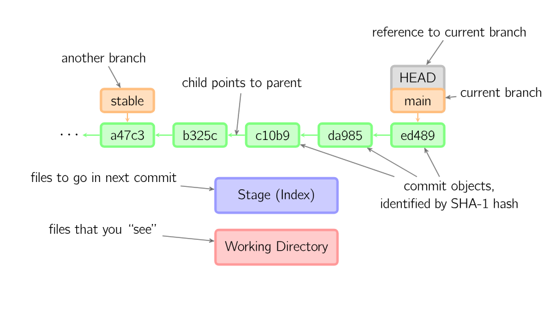

# Git / GitHub 操作备忘

> **适用**：本地 Git 仓库与 GitHub 远端（HTTPS / SSH）。  
> **平台**：Windows PowerShell / Git Bash；命令在 macOS / Linux 上通常相同。  
> **来源**：整理自 `Java/src/main/resources/document/tool/Github.md`（含配图）。  
> **官方**：[Git 文档](https://git-scm.com/doc) · [GitHub CLI](https://cli.github.com/manual/)

---

## 一、三个区域（先建立直觉）

| 区域 | 英文名 | 作用 |
|------|--------|------|
| **版本库** | History（Repository） | 已 `commit` 的快照链，在 `.git` 目录 |
| **暂存区** | Stage（Index） | `git add` 之后、等待提交的内容 |
| **工作目录** | Working Directory | 磁盘上正在编辑的文件 |



*上图：数据可在三层之间上下流动——`add` 进暂存区，`commit` 进版本库；`checkout` / `reset` / `restore` 可从上层回到下层。*

---

## 二、最先记住的 10 个命令

| 命令 | 作用 | 记忆提示 |
|------|------|----------|
| `git status` | 查看修改、暂存、未跟踪文件 | 动手前先 status |
| `git add <file>` | 把文件放入暂存区 | add = 上车 |
| `git add .` | 暂存当前目录全部变更 | 慎用，先看清 diff |
| `git commit -m "说明"` | 提交暂存区生成快照 | 说明写「为什么」 |
| `git pull` | 拉取远端并合并到当前分支 | 推送前先 pull |
| `git push` | 推送到远端 | 首次用 `-u origin HEAD` |
| `git diff` | 工作区 vs 暂存区差异 | 未 add 的改动 |
| `git diff --staged` | 暂存区 vs 上次提交 | 将要 commit 的内容 |
| `git log --oneline -10` | 最近 10 条提交 | 查历史 |
| `git clone <url>` | 克隆远程仓库 | 只需做一次 |

---

## 三、基本命令（对照三区）

| 命令 | 作用 |
|------|------|
| `git add <files>` | 把当前改动放入**暂存区** |
| `git commit` | 给暂存区做快照并写入**版本库** |
| `git reset -- <files>` | 撤销最后一次 `git add`（文件仍在工作区） |
| `git reset` | 撤销**全部**暂存 |
| `git checkout -- <files>` | 用暂存区覆盖工作区，**丢弃本地修改**（危险） |
| `git restore <files>` | Git 2.23+，同上，语义更清晰 |

### 交互模式（按块挑选）

对 diff 的每个 **hunk** 单独决定保留或丢弃：

| 命令 | 作用 |
|------|------|
| `git add -p` | 交互式暂存 |
| `git reset -p` | 交互式取消暂存 |
| `git checkout -p` | 交互式丢弃工作区修改 |


---

## 四、日常提交流程

```powershell
cd D:\path\to\your-repo
git status
git add path/to/file.md          # 或 git add .
git commit -m "docs: 更新说明"
git pull                         # 有远端时先拉
git push                         # 或 git push -u origin HEAD
```

| 步骤 | 命令 | 说明 |
|------|------|------|
| 看状态 | `git status -sb` | `-sb` 显示简短分支信息 |
| 暂存 | `git add <paths>` | 只 add 需要的文件 |
| 提交 | `git commit -m "..."` | 一条完整句子作说明 |
| 同步下行 | `git pull` | 冲突时在该仓库内单独解决 |
| 同步上行 | `git push` | 失败见下文「推送重试」 |

---

## 五、跳过暂存区（已跟踪文件）

| 命令 | 作用 |
|------|------|
| `git commit -a -m "..."` | ① 所有**已跟踪**文件加入暂存并提交 ② 一步完成（不含新文件） |
| `git commit <files> -m "..."` | ① 指定文件暂存并提交 ② 等价于对这些文件 `add` + `commit` |
| `git checkout HEAD -- <files>` | ① 用**最后一次提交**覆盖工作区 ② 丢弃本地修改（危险） |

新文件必须先 `git add`，`-a` 不会自动包含未跟踪文件。

---

## 六、查看差异（Diff）

| 命令 | 比较对象 |
|------|----------|
| `git diff` | 工作区 ↔ 暂存区 |
| `git diff --staged` | 暂存区 ↔ 最后一次提交 |
| `git diff <commit1> <commit2>` | 两次提交之间 |
| `git log -p -2` | 最近 2 次提交及补丁 |



*上图：从某次提交（如 `ed489`）可把内容检出到暂存区或工作区；`diff` 用于比较各层之间的差异。*

---

## 七、分支、HEAD 与提交链



### 图中符号约定

| 元素 | 含义 |
|------|------|
| **绿色方框**（如 `a47c3` … `ed489`） | 提交 ID，指向父提交，组成历史链 |
| **橙色方框**（如 `stable`、`main`） | **分支**，是指向某次提交的指针 |
| **灰色 `HEAD`** | 当前检出的位置，通常叠在当前分支上 |
| **当前最新提交** | 例图中 `main` 指向 `ed489`，即该分支尖端 |
| **蓝色 Stage / 红色 Working Directory** | 与第一节相同，表示当前检出下的暂存与工作区 |

| 操作 | 命令 |
|------|------|
| 查看分支 | `git branch` / `git branch -a` |
| 新建并切换 | `git switch -c feature/xxx` |
| 切换分支 | `git switch main` |
| 合并进当前分支 | `git merge other-branch` |
| 查看拓扑 | `git log --oneline --graph -15` |

---

## 八、案例：从 Git 中移除 `.idea`（仍保留本地）

IDE 配置不应进仓库时：

```bash
echo .idea >> .gitignore
git rm --cached -r .idea
git add .gitignore
git commit -m "chore: ignore .idea and stop tracking"
git push origin main
```

| 步骤 | 说明 |
|------|------|
| `.gitignore` | 以后不再跟踪 `.idea` |
| `git rm --cached` | 只从索引删除，**不删本地文件夹** |
| `push` | 远端历史里仍可能有旧记录；敏感内容需另做历史清理 |

---

## 九、克隆与远端

| 命令 | 作用 |
|------|------|
| `git clone https://github.com/user/repo.git` | HTTPS 克隆 |
| `git clone git@github.com:user/repo.git` | SSH 克隆 |
| `git remote -v` | 查看远端地址 |
| `git fetch` | 只拉取不合并 |
| `git pull` | `fetch` + 合并到当前分支 |
| `git push -u origin HEAD` | 推送并设置上游分支 |

私有仓库：HTTPS 用 [Personal Access Token](https://github.com/settings/tokens)；SSH 配 `~/.ssh` 密钥。

---

## 十、GitHub CLI（`gh`，可选）

安装：[cli.github.com](https://cli.github.com/)。登录：`gh auth login`。

| 命令 | 作用 |
|------|------|
| `gh repo clone user/repo` | 克隆仓库 |
| `gh pr list` | 列出 PR |
| `gh pr create` | 创建 PR |
| `gh pr view <n> --web` | 浏览器打开 PR |
| `gh pr checkout <n>` | 检出 PR 分支 |
| `gh issue list` | 列出 Issue |
| `gh workflow run <name>` | 触发 Actions（需权限） |

日常 `add / commit / push` 用 **git** 即可；PR、Issue、Actions 用 **gh** 更方便。

---

## 十一、本机多仓库工作区（Python）

工作区 `PythonBasic.code-workspace` 含多个**独立 Git 根**（各自 `git pull` / `push`）：

| 本地路径 | 远端仓库 |
|----------|----------|
| `D:\kan\kan\Python\AiBasic` | AiBasic |
| `D:\kan\kan\Python\PythonBasic` | PythonBasic |
| `D:\kan\kan\Python\knowledge_engineering` | knowledge_engineering |
| `D:\kan\kan\Python\learning_log` | learning_log |
| `D:\kan\kan\Python\mind-sync` | mind-sync（按需单独操作） |

| 你说 | 通常操作 |
|------|----------|
| **拉取工作区** | 各仓库根目录分别 `git pull` |
| **提交推送** | 有改动的仓库分别 `status` → `add` → `commit` → `push` |

确认当前仓库根目录：

```powershell
git rev-parse --show-toplevel
```

---

## 十二、推送失败重试

网络不稳时，最多重试 6 次（首次 + 5 次），每次间隔 2～5 秒：

```bash
git push -u origin HEAD
# 仍失败可加大缓冲：
git -c http.postBuffer=524288000 push -u origin HEAD
```

失败后执行 `git status -sb` 确认本地是否已提交、是否领先远端。

---

## 十三、在 Cursor / VS Code 里操作

侧栏 **源代码管理**（`Ctrl+Shift+G`）可暂存、提交、拉取、推送；命令面板搜 `Git: Pull` / `Git: Push` / `Git: Sync`。

快捷键详见 [vscode_shortcuts_windows.md](vscode_shortcuts_windows.md) 第六节；命令行流程见本文。

---

## 十四、与 mind-sync 的 GitHub 源

mind-sync 的 `sources.yaml` 里 `type: github` 会在同步时 **shallow clone/pull** 到 `sources/<id>`，不是替代你日常开发用的 `git` 流程。配置说明见 mind-sync 仓库 `docs/SOURCES.md`。

---

## 配图索引

| 文件 | 说明 |
|------|------|
| [images/git-three-areas.png](images/git-three-areas.png) | 三区结构 |
| [images/git-interactive-mode.png](images/git-interactive-mode.png) | 交互式 add/reset/checkout |
| [images/git-branches-head.png](images/git-branches-head.png) | 分支与 HEAD |
| [images/git-diff-flow.png](images/git-diff-flow.png) | Diff 与检出流向 |

详见 [images/README.md](images/README.md)。

---

## 参考链接

- [Pro Git（中文版）](https://git-scm.com/book/zh/v2)
- [GitHub Docs - Git 备忘](https://docs.github.com/en/get-started/git-basics/git-cheatsheet)
- [GitHub CLI manual](https://cli.github.com/manual/)
