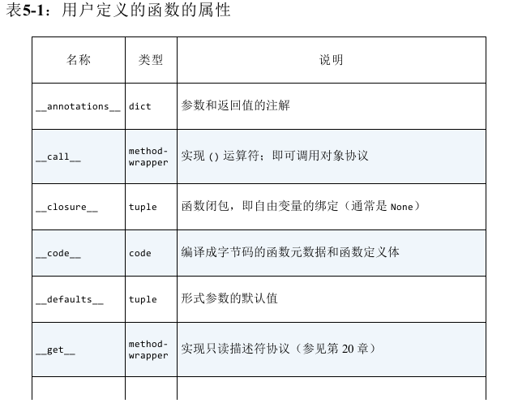
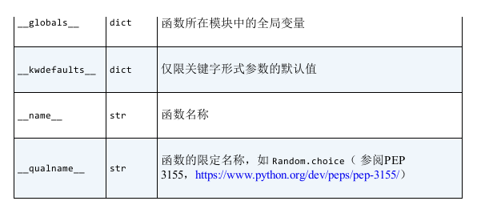

### 函数对象属性

+ \_\_defaults__:值是元组。例:def tag(name, *content, cls=None, **attrs):
  + 定位参数默认值：name默认值
  + 关键字参数默认值：name=xx, content=xx形式保存的值

+ \_\_kwdefaults__:仅限关键字参数默认值，*后面定义的参数如cls

+ \_\_code__：code对象引用，包含参数名称、参数个数等